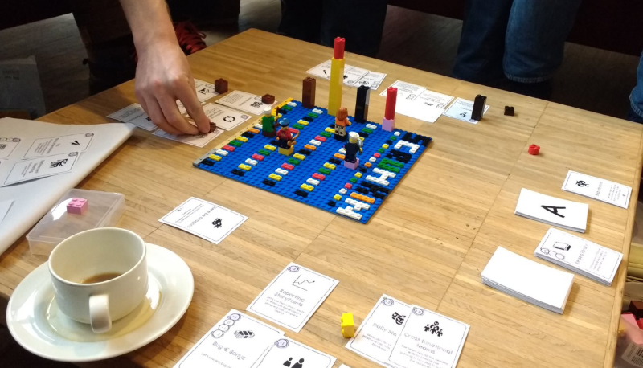
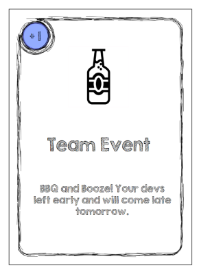
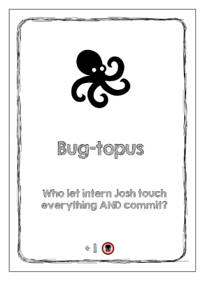
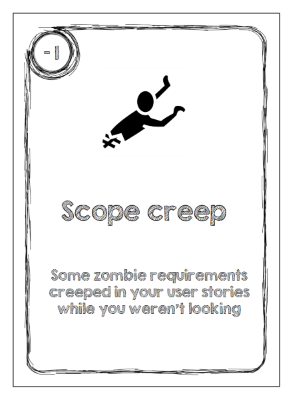
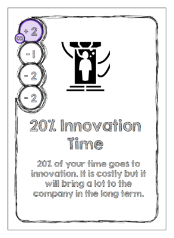
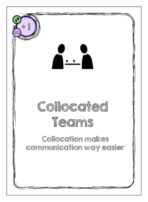

### Welcome to Scrumkin Inc.

Scrumkin is a visciously fun card game where you deal the best and worse software and management practices for fun and profit.

Played with the standard ruleset, the games takes about 45 min to be played.

Here's a picture of a play session at the Play4Agile2017 Unconference in Germany (with a custom built LEGO© game board):



#### Table of content

* Todo

#### Version history & changelog

* 2017.02.19 - 0.1

#### Contact

@timothep on Twitter or per email at: info@scrumkingame.info.

If you tweet about the game, please use the hashtag #ScrumKin.

### Rulebook

Each player represents a different Scrum team in an almost non-dysfunctional company. Even though they work on the same project, the players are not really working together on that new "Mammoth" product supposed to bring the company to the "next level". The teams share the common goal of delivering this revolutionary product on time, on budget, with top notch quality and the complete scope (that's not an iron triangle anymore), but if one player could be more on time than the others, it would be better for his/her career... that's our winner.

#### Game content

* 110 cards
  * 22 "action cards"
  * 88 "sprint cards"
* The game board
  * Todo: template to print
  * Alternatively, you can use stacked up LEGO Bricks
* A "Velocity-Meter" board
  * Todo: template to print
* 4-8 game pieces (2 per players, one for the game board and one for the velocity board)
  * Todo: template to print

#### Artifacts

The game builds upon two artifacts:
* A backlog of 10 items for each player. The goal is for each player to fully implement (burn down) his own backlog.
* The velocity at which the player is implementing backlog items, measured in "number of backlog items per sprint"

#### Cards

Each card has a title, a description and an artwork.

Each card has either:
* Values placed on the top-left corner: velocity modifiers.
* Values placed at the bottom of the card: backlog modifiers.

#### Action cards

Action cards are of two kinds:
* Boosters (blue circles), the value indicates a velocity change for all the players.
* Bugs (red monster at the bottom), the value indicates the number of bugs to add to the backlog.




#### Sprint cards

Sprint cards only affect velocity, but can have multiple values over time:

* A circle with a value indicates a velocity change for the current sprint only.
* A circle with an ∞ character (and a violet background) indicates a permanent velocity change.
* If more than one circle is present, the circles represent values over time.
  * The bottom circle is the value to use for the sprint when you play the card.
  * Then going up are sprints n+1, n+2 and n+3.
  * If the top-most sprint has an infinite modifier, when this sprint is reached, all other sprints take this value into account.
  * Use paperclips or partially cover the card with another card to indicate which value is actual.




* Cards with a small "green shield" are defensive cards. They can be used to counter any card laid down at any time during the game. Those can of course also be used as plain normal cards during your turn.



#### Setup

* Put all the "Event cards" in one "Event stack", all the others forming the "Sprint Stack".
* Place the game pieces on the start position on the board.
* Place the game pieces on the 0 position on the velocity-meter game board
* Each player picks 3 cards from the "Sprint Stack"
  * At the end of the turn, all players will refill their hands to have 3 cards again.

#### Starting the Game

The last player who ate some chocolate is the "leader" for the first round and starts the game (if there is a draw, the first to eat some more starts). The leader role is then passed on to another player at each turn on a clockwise basis.

The leader pulls the top most action card and reads it out loud:
* If it is a boost card (blue bubble), the velocity boost applies to everyone for this round.
* If it is a bug card (red bubble), the leader adds as many bugs to his/her backlog (the number of bugs displayed on bottom of the card) and thus walks backward on the game board.
  * Example: if you have 8 backlog items left and draw an bug card with 3 bugs, you put your game piece on the 11.
  * If your board doesn't go that far, you go as far as it gets and the remaining bugs are not accounted for.

#### Sprint

Starting with the leader, each player plays 2 of the following options:
1. Play a card in his/her own game by placing face up on the table in front of himself.
2. Play a card in somebody else's game by placing it face up on the table in front of this other person.
3. Discard one card by putting it back face down at the end of the stack.

Everyone must play, “passing” is not allowed.
Here are all the possible moves a player can make:

| Player's own game | Another player's game | Drop the card |
| :- | :- | :- |
| X | X |  |
| | X | X |
| X |  | X |

#### Computing your velocity

When the sprint is over for all the players, each player adds up the numbers on his/her cards to find out his/her current velocity. The velocity is computed in an absolute way. At each turn you sum up all the velocity modifiers that are in your game on the table, and this is your velocity for the round.

The velocity is then made visible to all via the Velocity-Meter.
* If your velocity is greater than zero, you have completed some features! You can remove as many items from your backlog.
* If your velocity is smaller or equals to zero, you didn't finish any features during this sprint (this doesn't add features to your backlog). Bugs count like any other item.

#### Setup for the next round

At the end of each sprint, each player refills his hand to have 3 cards. Players that have cards with values over time also update those values.

#### Finishing the game

The winner is the player to finish his/her entire backlog first.

#### Collaborative Rulebook

Here is an alternative way of playing. Now, all the teams are playing collaboratively. There is a time limit of 10 sprints to complete the entire backlog of all the players. If the entire backlog is completed, everybody wins, otherwise everybody loses:

The game mechanics and the cards remain the same, except for those small tweaks:

* Players are not allowed to drop cards, they can only play in their game, or someone else's game.
* Players can help each other by implementing work items for another player. For each item a player overtakes from someone else's backlog, the new owner takes a -1 velocity penalty. The penalty remains until the item(s) are all implemented.
  * Ex: Thelma volunteers to take over 3 backlog items from Louise. Thelma has now +3 backlog items and -3 Velocity penalty. In the first round, Thelma implements 2 items. In the next round, Thelma has only +1 backlog item left and a velocity penalty of -1.
* A velocity < -3 will add as many bugs to your backlog
  * Example: -5 velocity -> +5 bugs

#### Scrumkin for Retrospective

* Todo

### Tweaks and Ideas

* In the collaborative version, allow for dropping cards against bugs
* Todo (many more to come)

### FAQ

* Where do the name 'Scrumkin' comes from?
> The original idea behind the game was to reuse the game mechanics of the game Munchkin and adapt it into the software practices world. Thus the name Scrumkin. Somehow, the rules changed quite a lot, but the name remained... for now. If you have a good idea for an alternative name, let me know.

### Behind the covers - Generate the game yourself

#### Output

In the "\_Output" folder you will find a pre-generated version of the game i.e. all the cards as PNG Files and two PDF files (for print on differently colored paper).

#### Generate the cards

Scrumkin is generated using the Ruby Framework [Squib](https://github.com/andymeneely/squib). Please refer to its documentation for installation instructions. At the time of writing these lines, you need to install ruby 2.0 and install Squib via:

```ruby
gem install squib
```

Then to generate the cards, just call:

```ruby
ruby deck.rb
```

#### Structure

All the data is to be found in the MS Excel files:
* data_sprint.xlsx -> All the sprint cards
* data_action.xlsx -> All the action cards
* data_covers.xlsx -> Two backside

Those sets are created separately. To change the set being created, comment and uncomment the required lines at the beginning of the 'deck.rb' file:

```ruby
data = Squib.xlsx file: 'data_sprint.xlsx' #Will generate only the sprint cards
#data = Squib.xlsx file: 'data_action.xlsx' #Commented out
#data = Squib.xlsx file: 'data_covers.xlsx' #Commented out
```

> Nota: the images and pdfs created in the output folder will overwrite any pre-existing data. Save your generated content somewhere else when you are happy with it.

### Thanks

Thanks a lot to all the beta testers. Special thanks to my colleagues at the Frühjahrscampus 2016, Udo and his agile tribe, the crazy french J&G and the participants of the P4A17 Unconference.

### License

* The game is shared under the CreativeCommon-Attribution-NonCommercial-ShareAlike 4.0 International license.
* The font used is [KG Second Chance](http://www.dafont.com/kg-second-chances.font). It is free for personal use. For commercial licensing, please see the following [website](http://kimberlygeswein.com).
* All the icons were created by various authors and can be found on [Game-icons.net](http://game-icons.net/). Many thanks to them.
